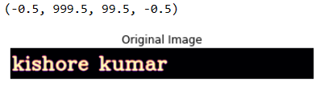

# Opening-and-Closing

## Aim
To implement Opening and Closing using Python and OpenCV.

## Software Required
1. Anaconda - Python 3.7
2. OpenCV
## Algorithm:
### Step1:

Import the necessary packages.

### Step2:

Create the Text using cv2.putText.

### Step3:

Create the structuring element.
### Step4:

Use Opening operation.

### Step5:

Use Closing Operation.

### step 6:
Print the output and end the program.
 
## Program:


# Import the necessary packages
```
import cv2
import numpy as np
import matplotlib.pyplot as plt

```
# Create the Text using cv2.putText
```
text_image = np.zeros((100,1000),dtype = 'uint8')
font = cv2.FONT_HERSHEY_SIMPLEX = 3
cv2.putText(text_image,"kishore kumar",(5,70),font,2,(255),5,cv2.LINE_AA)
plt.title("Original Image")
plt.imshow(text_image,'magma')
plt.axis('off')
```
# Create the structuring element
```
kernel = cv2.getStructuringElement(cv2.MORPH_CROSS,(7,7))
```
# Use Opening operation
```
opening_image = cv2.morphologyEx(text_image,cv2.MORPH_OPEN,kernel)
plt.title("Opening")
plt.imshow(opening_image,'magma')
plt.axis('off')
```


# Use Closing Operation
```
closing_image = cv2.morphologyEx(text_image,cv2.MORPH_CLOSE,kernel)
plt.title("Closing")
plt.imshow(closing_image,'magma')
plt.axis('off')


```
## Output:

### Display the input Image


### Display the result of Opening


### Display the result of Closing

## Result
Thus the Opening and Closing operation is used in the image using python and OpenCV.